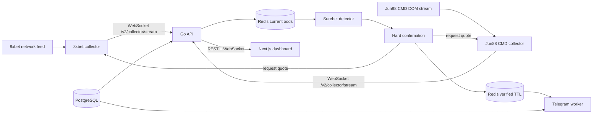

# Kiến trúc Runtime

## Luồng dữ liệu

## Nguồn dữ liệu

- 8xbet lấy fixture metadata và odds từ response/WebSocket upstream. DOM chỉ dùng để giữ page hoạt động và xác nhận định dạng Kèo Malay.
- Jun88 CMD dùng `MutationObserver` và callback trực tiếp về Node khi row odds thay đổi.
- Mỗi worker giữ một collector WebSocket dài hạn. Khi reconnect, worker gửi snapshot đầy đủ trước delta.

## Lưu trữ

- Redis là source of truth cho current odds và verified opportunity ngắn hạn.
- PostgreSQL lưu người dùng, runtime settings, Telegram recipients và notification logs.
- Redis AOF được bật trong Compose để giảm mất current-state khi restart.

## Xác nhận cơ hội

Candidate không được gửi Telegram. Backend yêu cầu hai collector đọc lại đúng fixture, market và outcome; detector chỉ tạo confirmed opportunity khi hai kết quả còn mới, không ambiguous và vẫn có lợi nhuận. Kết quả verified có TTL ngắn và bị vô hiệu ngay khi một leg đổi.

## Public read path

- Frontend đọc REST để bootstrap/reconcile.
- `/v1/ws` phát odds và verification update realtime.
- `/v2/collector/stream` chỉ dành cho collector ingest và hard-confirm protocol.
