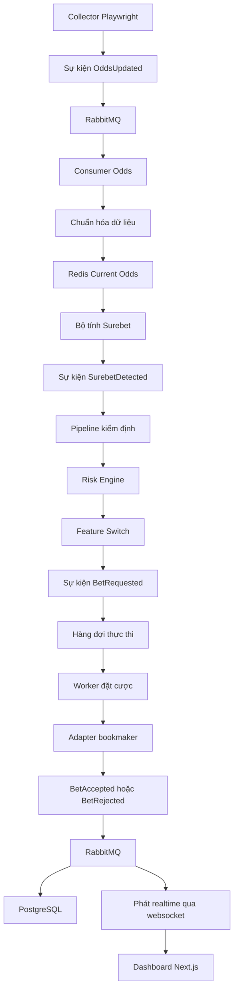
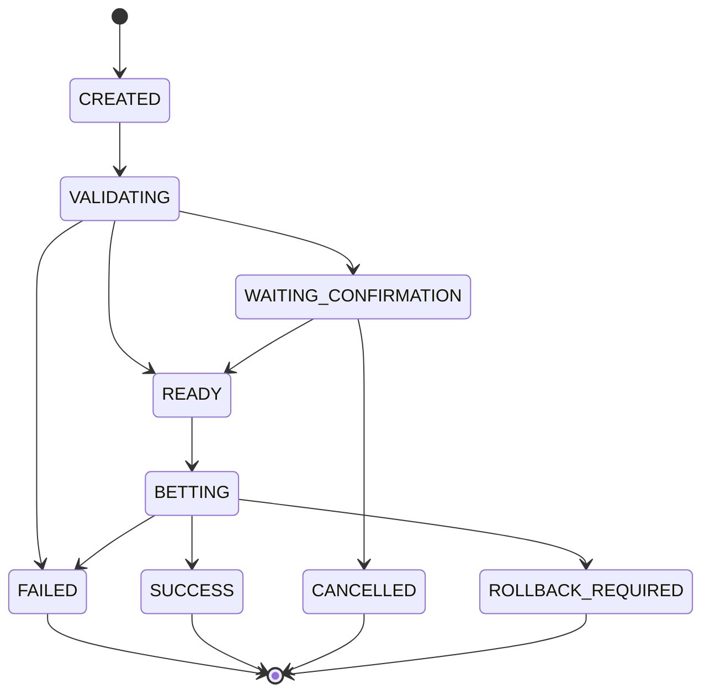

# Kiến trúc Nền tảng Surebet

## Tổng quan

Repository này là bộ khung kiến trúc production-grade cho nền tảng Surebet + Auto Bet realtime, được thiết kế để dễ mở rộng theo chiều ngang.

Các nguyên tắc cốt lõi:

- Clean Architecture với ranh giới rõ ràng, ưu tiên interface
- Luồng xử lý hướng sự kiện qua RabbitMQ
- Tách CQRS giữa xử lý lệnh và truy vấn dữ liệu
- Redis dùng cho cache realtime và điều phối đồng bộ
- PostgreSQL là nguồn dữ liệu giao dịch chính
- API và worker stateless để sẵn sàng cho Kubernetes trong tương lai

## Cấu trúc Monorepo

```text
surebet/
├── backend/
│   ├── cmd/
│   │   ├── api/
│   │   └── worker/
│   ├── internal/
│   │   ├── api/
│   │   ├── auth/
│   │   ├── autobet/
│   │   ├── calculator/
│   │   ├── collector/
│   │   ├── config/
│   │   ├── dto/
│   │   ├── eventbus/
│   │   ├── execution/
│   │   ├── feature/
│   │   ├── logger/
│   │   ├── middleware/
│   │   ├── metrics/
│   │   ├── models/
│   │   ├── notification/
│   │   ├── odds/
│   │   ├── parser/
│   │   ├── repository/
│   │   ├── risk/
│   │   ├── validator/
│   │   └── websocket/
│   └── pkg/
│       └── health/
├── collector/
│   ├── bookmaker-a/
│   ├── bookmaker-b-lobby1/
│   ├── bookmaker-b-lobby2/
│   ├── bookmaker-b-lobby3/
│   └── shared/
├── deploy/
├── docs/
└── frontend/
```

## Luồng hệ thống



## Sơ đồ kiến trúc

```mermaid
flowchart LR
    subgraph Collectors
        C1[bookmaker-a] - 8xbet
        C2[bookmaker-b-lobby1] - jun88 - sabe
          C3[bookmaker-b-lobby2]
        C4[bookmaker-b-lobby3]
    end

    subgraph Messaging
        MQ[RabbitMQ]
    end

    subgraph Backend
        API[Gin API]
        W1[Worker Odds / Validation]
        W2[Worker Execution]
        WS[Websocket Hub]
    end

    subgraph Data
        R[(Redis)]
        P[(PostgreSQL)]
    end

    subgraph Frontend
        FE[Dashboard Next.js]
    end

    C1 --> MQ
    C2 --> MQ
    C3 --> MQ
    C4 --> MQ
    MQ --> W1
    W1 --> R
    W1 --> MQ
    MQ --> W2
    W2 --> P
    W2 --> MQ
    MQ --> WS
    API --> P
    API --> R
    WS --> FE
    API --> FE
```

## Phân chia trách nhiệm

- Collectors
  - Chịu trách nhiệm scrape riêng theo từng bookmaker và tái sử dụng session
  - Chỉ phát sự kiện cập nhật odds ở dạng raw hoặc normalized
  - Không tính surebet và không thực hiện đặt cược

- API
  - Cung cấp REST endpoint và bootstrap websocket
  - Phục vụ current odds, surebets, feature flags, orders và audit
  - Nhận xác nhận thủ công và các lệnh quản trị

- Worker
  - Consume domain queue và execution queue
  - Chạy validation pipeline và risk engine
  - Phát sự kiện bet request và execution result

- Execution Adapter Layer
  - Đóng gói phần triển khai đặt cược theo từng bookmaker
  - Quản lý lock theo account, fixture và market
  - Chỉ trả kết quả provider thông qua interface

- PostgreSQL
  - Là nguồn dữ liệu chuẩn cho users, accounts, orders, results, flags và audit

- Redis
  - Cache current odds
  - Cache current surebet
  - Cache account session
  - Distributed lock
  - Bộ đếm rate limit

## Thứ tự validation pipeline

1. `SUREBET_STILL_EXISTS`
2. `LATEST_ODDS_FETCHED`
3. `ODDS_NOT_CHANGED`
4. `PROFIT_THRESHOLD`
5. `BOOKMAKER_AVAILABLE`
6. `ACCOUNT_LOGGED_IN`
7. `BALANCE_AVAILABLE`
8. `STAKE_VALID`
9. `MARKET_NOT_SUSPENDED`
10. `DUPLICATE_ORDER`
11. `RISK_SCORE`
12. `FEATURE_SWITCH_ENABLED`

Không được phát `BetRequested` trước khi toàn bộ bước kiểm định đều thành công.

## State machine



## Định hướng mở rộng ngang trong tương lai

- Scale collector độc lập theo bookmaker và lobby
- Giữ API stateless phía sau load balancer
- Tách worker theo chức năng: normalization, validation, execution, persistence, websocket broadcasting
- Tách queue và consumer group riêng để tối ưu prefetch
- Dùng Redis lock để điều phối an toàn giữa nhiều worker
- Khi hệ thống lớn hơn, có thể tách quản trị cấu hình và feature flag thành dịch vụ trung tâm
