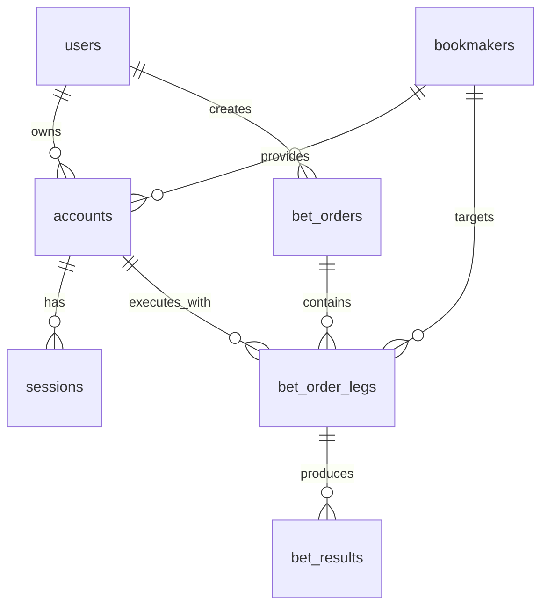

# Kiến trúc Cơ sở dữ liệu

## Mục tiêu

Tài liệu này mô tả kiến trúc dữ liệu hiện tại của nền tảng Surebet, tập trung vào:

- Vai trò của PostgreSQL trong hệ thống
- Vai trò của Redis trong realtime workflow
- Quan hệ giữa các bảng nghiệp vụ
- Chiến lược đọc/ghi dữ liệu
- Định hướng mở rộng khi lưu lượng tăng

Ở giai đoạn hiện tại, hệ thống chưa dùng kho lưu trữ phân tích riêng. PostgreSQL là nguồn dữ liệu giao dịch chính, còn Redis phục vụ cache và điều phối realtime.

## Nguyên tắc thiết kế

- PostgreSQL là source of truth cho dữ liệu nghiệp vụ quan trọng
- Redis chỉ giữ dữ liệu tạm thời, cache hoặc dữ liệu điều phối
- Trạng thái nghiệp vụ phải được biểu diễn bằng enum/string rõ ràng, không dùng boolean cho state machine
- Mọi thao tác thay đổi quan trọng cần có khả năng audit
- Thiết kế bảng ưu tiên rõ domain boundary trước khi tối ưu quá sớm

## Thành phần lưu trữ

## PostgreSQL

PostgreSQL lưu:

- Người dùng hệ thống
- Tài khoản bookmaker
- Phiên đăng nhập bookmaker
- Lệnh cược và kết quả cược
- Feature flag
- Cấu hình hệ thống
- Audit log

Đây là lớp dữ liệu cần đảm bảo tính nhất quán cao và có thể truy vết.

## Redis

Redis lưu:

- Current odds
- Current surebet
- Session cache theo account
- Distributed lock
- Rate limit counter

Redis không phải nơi lưu trạng thái nghiệp vụ cuối cùng. Nếu Redis mất dữ liệu, hệ thống vẫn phải có khả năng tái tạo lại từ luồng collector hoặc dữ liệu giao dịch.

## Phân vùng domain dữ liệu

## 1. Quản trị người dùng và tài khoản

Các bảng:

- `users`
- `bookmakers`
- `accounts`
- `sessions`

Vai trò:

- `users`: định danh người dùng vận hành hệ thống
- `bookmakers`: danh mục nhà cái được hệ thống hỗ trợ
- `accounts`: tài khoản bookmaker gắn với người dùng hoặc operator
- `sessions`: trạng thái phiên đăng nhập của từng account vào bookmaker

Quan hệ:

- Một `user` có thể có nhiều `accounts`
- Một `bookmaker` có thể có nhiều `accounts`
- Một `account` có thể có nhiều `sessions`

## 2. Miền đặt cược

Các bảng:

- `bet_orders`
- `bet_order_legs`
- `bet_results`

Vai trò:

- `bet_orders`: thực thể trung tâm của vòng đời đặt cược
- `bet_order_legs`: từng nhánh cược thuộc một lệnh cược
- `bet_results`: kết quả phản hồi từ provider cho từng leg

Quan hệ:

- Một `bet_order` có nhiều `bet_order_legs`
- Một `bet_order_leg` có thể có một hoặc nhiều `bet_results` theo chiến lược lưu kết quả sau này

Gợi ý nghiệp vụ:

- `bet_orders` nên là aggregate root cho execution flow
- `bet_order_legs` giúp biểu diễn surebet nhiều nhánh
- `bet_results` là dấu vết hệ thống nhận từ bookmaker hoặc adapter thực thi

## 3. Quản trị cấu hình

Các bảng:

- `feature_flags`
- `configurations`

Vai trò:

- `feature_flags`: bật/tắt chức năng theo runtime
- `configurations`: chứa tham số hệ thống không nên hard-code

Hai bảng này hỗ trợ thay đổi hành vi hệ thống mà không cần deploy lại trong nhiều trường hợp.

## 4. Audit và truy vết

Các bảng:

- `audit_logs`

Vai trò:

- Ghi lại thay đổi quan trọng trên thực thể nghiệp vụ
- Lưu actor, trace id, loại hành động và payload liên quan

Đây là bảng rất quan trọng cho vận hành, kiểm soát rủi ro và điều tra sự cố.

## Sơ đồ quan hệ dữ liệu

## Luồng ghi dữ liệu

## Luồng 1: Đồng bộ tài khoản và session

1. Collector hoặc execution adapter xác nhận tình trạng đăng nhập.
2. Dữ liệu session mới được cập nhật vào `sessions`.
3. Thông tin balance hoặc last login có thể cập nhật vào `accounts`.

## Luồng 2: Tạo lệnh cược thủ công hoặc tự động

1. Hệ thống tạo bản ghi trong `bet_orders`.
2. Tạo các bản ghi `bet_order_legs` tương ứng.
3. Khi execution bắt đầu, cập nhật `status` của `bet_orders`.
4. Khi có kết quả từ provider, ghi vào `bet_results`.
5. Đồng thời ghi `audit_logs` cho các bước quan trọng.

## Luồng 3: Thay đổi feature flag hoặc cấu hình

1. Thay đổi được ghi vào `feature_flags` hoặc `configurations`.
2. Hành động thay đổi cần sinh `audit_logs`.
3. Lớp query hoặc cache có thể refresh lại dữ liệu phục vụ runtime evaluation.

## Luồng đọc dữ liệu

## Dashboard query

Frontend hoặc API sẽ đọc:

- `bet_orders` để hiển thị trạng thái vòng đời cược
- `bet_results` để hiển thị kết quả execution
- `feature_flags` để hiển thị trạng thái bật/tắt
- `accounts` và `sessions` để hiển thị tình trạng tài khoản

## Realtime query

Realtime flow không nên đọc PostgreSQL quá thường xuyên cho dữ liệu biến động nhanh. Thay vào đó:

- Current odds lấy từ Redis
- Current surebet lấy từ Redis
- Lock và coordination lấy từ Redis
- PostgreSQL chỉ dùng khi cần dữ liệu giao dịch hoặc truy vết chính xác

## Khuyến nghị chỉ mục

Các chỉ mục nên có hoặc nên bổ sung ở bước tiếp theo:

- `users.email` unique
- `bookmakers.code` unique
- `accounts.user_id`
- `accounts.bookmaker_id`
- `sessions.account_id`
- `bet_orders.user_id`
- `bet_orders.opportunity_id`
- `bet_orders.status`
- `bet_order_legs.bet_order_id`
- `bet_order_legs.account_id`
- `bet_results.bet_order_id`
- `bet_results.bet_order_leg_id`
- `audit_logs.entity_type, audit_logs.entity_id`
- `audit_logs.trace_id`
- `feature_flags.name` unique
- `configurations.key` unique

## Quy ước trạng thái

`bet_orders.status` phải dùng state machine dạng chuỗi:

- `CREATED`
- `VALIDATING`
- `WAITING_CONFIRMATION`
- `READY`
- `BETTING`
- `SUCCESS`
- `FAILED`
- `CANCELLED`
- `ROLLBACK_REQUIRED`

Không dùng nhiều cột boolean như `is_success`, `is_failed`, `is_processing` để mô tả cùng một lifecycle.

## Quy ước transaction

Nên dùng transaction PostgreSQL cho các cụm thao tác sau:

- Tạo `bet_orders` và `bet_order_legs`
- Cập nhật trạng thái `bet_orders` kèm ghi `audit_logs`
- Ghi `bet_results` và cập nhật trạng thái tổng hợp của order nếu cần

Không nên kéo transaction qua các thao tác mạng như:

- Gọi bookmaker adapter
- Chờ Playwright thực thi
- Chờ consumer bất đồng bộ ngoài tiến trình

## Soft delete

Nhiều bảng hiện có `deleted_at`, nghĩa là hệ thống đang đi theo hướng soft delete.

Khuyến nghị:

- Không dùng soft delete cho dữ liệu execution history nếu sau này cần tính bất biến cao
- Với bảng cấu hình hoặc account, soft delete là hợp lý để phục vụ audit và rollback vận hành

## Định hướng mở rộng tương lai

Khi hệ thống tăng tải, có thể tách rõ:

- PostgreSQL write model cho giao dịch
- Redis cho realtime materialized state
- Một kho lưu trữ lịch sử/phân tích riêng cho odds history, risk history, latency, execution analytics

Khi đó nên giữ nguyên interface domain hiện tại và chỉ thay adapter lưu trữ ở tầng ngoài.

## Danh sách bảng hiện tại

Theo bootstrap SQL hiện có trong [deploy/postgres/init/001_base.sql](/home/truonghocdot/study/surebet/deploy/postgres/init/001_base.sql:1), các bảng đang được khởi tạo gồm:

- `users`
- `bookmakers`
- `accounts`
- `sessions`
- `bet_orders`
- `bet_order_legs`
- `bet_results`
- `audit_logs`
- `feature_flags`
- `configurations`

## Gợi ý bước tiếp theo

1. Tách migration PostgreSQL sang công cụ migration chuẩn thay vì chỉ dùng init SQL.
2. Bổ sung index thực tế vào migration thay vì chỉ dừng ở foreign key cơ bản.
3. Thiết kế read model cho dashboard thay vì query trực tiếp từ bảng giao dịch ở mọi màn hình.
4. Chuẩn hóa quy ước audit cho mọi command quan trọng trong hệ thống.
