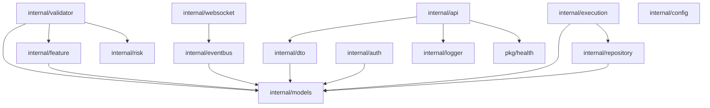

# Sơ đồ Phụ thuộc

## Sơ đồ mức cao

## Hướng dẫn triển khai

- Giữ event payload ổn định và có version
- Khi bắt đầu làm persistence, nên đặt phần implement repository trong các adapter package riêng
- Execution adapter nên tách theo từng bookmaker, không gom vào một package khổng lồ
- API handler nên mỏng, không chứa orchestration logic
